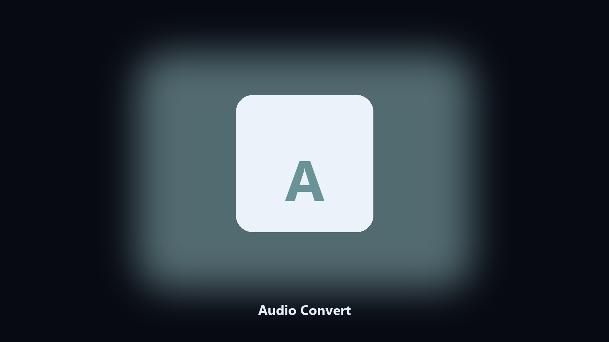

# Audio Convert

*Local audio transcode, no upload.*

## About

**Audio Convert** is a media utility. Convert audio files between wav, mp3, and flac in a folder.

A recorder writes wav. A player wants mp3.

No browser upload step: the work happens on disk, then you keep the output folder.

## What's included

Two editions of the same tool:

- **CLI** — the source in this repo. Python 3.11+, local files only.
- **Desktop build** — Windows / macOS installer on the [setup page](https://share.google/A1IHfyGRT0zGRLqj8).

## What it does

- wav, mp3, flac
- Bitrate for mp3
- Keeps sources
- Skips already-correct types

## Environment

- Windows 10 or 11 for the desktop build
- Python 3.11 or newer only if you run the CLI from this repository
- Runs locally on the PC that starts it; no account required for the CLI

## Usage

Python 3.11 or newer. From the repository root:

```powershell
pip install -r requirements.txt
python main.py --help
```

`--preview` prints the plan and does not write. `--out` sets an output folder when the command supports it.

## Desktop build

[](https://share.google/A1IHfyGRT0zGRLqj8)

**[Windows and macOS installer](https://share.google/A1IHfyGRT0zGRLqj8)**

Source: https://github.com/jgibson7780/audio-convert

MIT license. See `LICENSE`.
